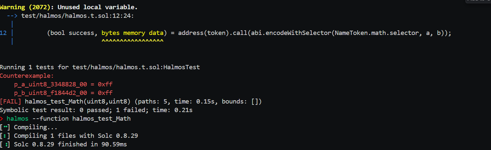

1. Install halmos 
```
sudo apt-get update
sudo apt-get install build-essential python3.12-dev
curl -LsSf https://astral.sh/uv/install.sh | sh
uv tool install --python 3.12 halmos
```


2. setup a test file named something halmos.t.s.sol 

Example :
```solidity
    function math(uint8 a, uint8 b) public pure returns (uint8) {
        return a + b;
    }
```

the test case is like this 
```solidity
import {Test} from "forge-std/Test.sol";
import {NameToken} from "../../src/Token.sol";  

contract HalmosTest is Test {
    NameToken public token;

    function setUp() public {
        token = new NameToken("Test Token", "TT");
    }

    function halmos_test_math(uint8 a, uint8 b) public {
        (bool success, ) = address(token).call(abi.encodeWithSelector(NameToken.math.selector, a, b));
        assertEq(success, true);
    }
}
```
Here we are testing the math function of the contract. 

Run the tool through the command line 
```
halmos --function halmos_test_math
``` 


Found that the when a = 255 and b =255 the function will revert. 
```